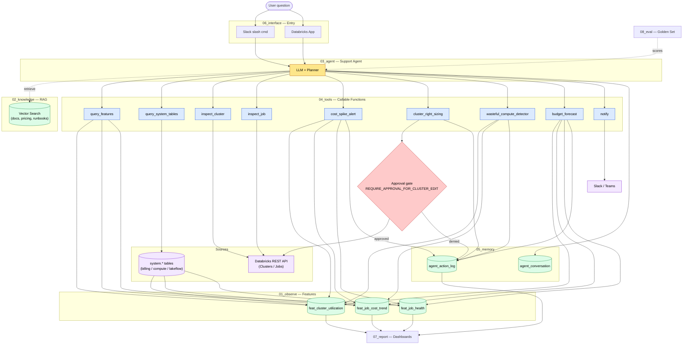

# IntelliOps V2 — Architecture Reference

> **Authoritative source for architectural decisions.** Any change to module boundaries, data flow, or stage responsibilities must be checked against this document. If a change is needed, update this file first.

## 1. What IntelliOps Is

IntelliOps is a **support agent for Databricks cost observability** at the **job and cluster** level. It is not a scheduled prediction pipeline. It answers questions like:

- "Why did cluster `cluster-prod-xyz` cost $400 yesterday?"
- "Which jobs in workspace W are wasting the most spend this week?"
- "Should I right-size `etl-nightly`? Show me utilization and propose worker counts."
- "Are we on track to hit the monthly budget?"

The agent reasons over pre-aggregated features (fast/cheap) and falls back to on-demand SQL against `system.*` tables when needed. ML prediction is intentionally out of scope.

## 2. Pipeline Shape

```
                 ┌──────────────┐
 User question ─►│  Interface   │
                 └──────┬───────┘
                        ▼
                 ┌──────────────┐     reads     ┌────────────┐
                 │    Agent     │◄──────────────│ Knowledge  │
                 │ (LLM + plan) │               │   (RAG)    │
                 └──────┬───────┘               └────────────┘
                  calls │ tools                 ▲
                        ▼                       │
                 ┌──────────────┐               │
                 │    Tools     │───reads───►   │
                 └──────┬───────┘               │
                        │                        │
        ┌───────────────┼───────────────┐       │
        ▼               ▼               ▼       │
   ┌─────────┐   ┌────────────┐   ┌──────────┐  │
   │ Observe │   │ system.*   │   │ REST API │  │
   │ (Delta) │   │ (on-demand)│   │ (gated)  │  │
   └─────────┘   └────────────┘   └──────────┘  │
                        │                        │
                        ▼                        │
                 ┌──────────────┐                │
                 │   Memory     │────────────────┘
                 │ (log + chat) │
                 └──────┬───────┘
                        ▼
                 ┌──────────────┐
                 │   Report     │  (always-on dashboards)
                 └──────────────┘

   Eval runs offline against a golden question set.
```

## 3. Project Layout

```
IntelliOps/
├── config/
│   └── config.py                       # Central config (catalog, thresholds, budgets, model endpoint)
├── 00_setup/
│   └── 00_setup_feature_store.py       # DDL for Delta tables (features, action log, memory)
├── 01_observe/                         # Feature engineering — unchanged
│   ├── 01_feat_cluster_utilization.py
│   ├── 02_feat_job_cost_trend.py
│   └── 03_feat_job_health.py
├── 02_knowledge/                       # RAG index over docs / pricing / runbooks
├── 03_agent/                           # LLM + planner; the support agent itself
├── 04_tools/                           # Callable functions the agent invokes
│   ├── databricks_api.py               # Clusters / Jobs REST wrapper
│   ├── notifications.py                # Slack / Teams webhooks
│   ├── 01_cost_spike_alert.py          # Tool: detect & explain cost spikes
│   ├── 02_cluster_right_sizing.py      # Tool: propose worker counts (gated)
│   ├── 03_wasteful_compute_detector.py # Tool: scan for waste
│   └── 04_budget_forecast.py           # Tool: linear EOM projection
├── 05_memory/                          # agent_action_log + conversation history
├── 06_interface/                       # Slack bot / Databricks App entry points
├── 07_report/                          # Genie dashboards (always-on glanceable view)
│   ├── 01_cost_command_center.py
│   ├── 02_cluster_health_map.py
│   ├── 03_job_reliability.py
│   └── 04_optimization_leaderboard.py
├── 08_eval/                            # Golden question set + agent scoring
└── orchestrator.py                     # Runs scheduled work: Observe, Knowledge, Report
```

Implementation status: `config/`, `00_setup/`, `01_observe/`, `02_knowledge/`, `03_agent/`, `04_tools/`, `05_memory/`, `07_report/` are populated. `06_interface/` and `08_eval/` are placeholders for the next phase.

## 4. Module-Wise Responsibilities

### `config/` — Configuration
Central tunables consumed via `%run ./config/config`. Catalog, thresholds, budgets, MLflow model paths (now empty), agent LLM endpoint, webhook URLs.

### `00_setup/` — Bootstrap
DDL for Delta tables in Unity Catalog: feature tables (3), `agent_action_log`, `agent_conversation` (new), knowledge index metadata (new).

### `01_observe/` — Feature Engineering (Cache Layer)
Materializes pre-aggregated features from `system.*` into Delta. **These tables are a cache, not a moat** — `system.*` remains the source of truth. The cache exists because:

1. **Cost-to-dollar joins are non-trivial.** `system.billing.usage` reports DBUs; converting to USD requires joining `system.billing.list_prices` and computing rolling averages + growth %. Doing this per question burns SQL Warehouse time and tokens.
2. **Dashboards need low-latency reads.** `07_report` aggregates across thousands of clusters/jobs; live aggregation against raw `node_timeline` is too slow.

Trade-off: features are stale by up to one refresh interval (~15 min). For anything fresher or not pre-aggregated, the agent uses `query_system_tables` (see `04_tools/`). Cadence ~15 min.

| Notebook | Source | Output |
|---|---|---|
| `01_feat_cluster_utilization` | `system.compute.node_timeline` | Hourly CPU/memory/node count per cluster |
| `02_feat_job_cost_trend` | `system.billing.*` + `lakeflow.jobs` | Daily cost, 14-day rolling avg, growth % |
| `03_feat_job_health` | `system.lakeflow.job_run_timeline` | Failure rate, duration stats (30-day) |

### `02_knowledge/` — Knowledge Base (RAG)
Two notebooks plus one Python module:
- `00_seed_knowledge_docs.py` — seeds `intelliops.knowledge.knowledge_docs` (Delta table with Change Data Feed) with curated cost/pricing/runbook snippets.
- `01_build_knowledge_index.py` — creates the `intelliops_vs_endpoint` Vector Search endpoint and a Delta-sync index (`knowledge_docs_idx`) over the docs table, embedded with `databricks-gte-large-en`.
- `knowledge.py` — `search_knowledge(query, num_results)` thin wrapper over the index. Falls back gracefully if the index is unreachable.

Refresh: re-run `01_build_knowledge_index` after appending rows to the docs table; the index is `TRIGGERED` (not continuous) to keep cost predictable.

### `03_agent/` — Support Agent
The LLM-driven core, built on **LangGraph**. Files:
- `tools.py` — pure-function implementations (`query_features`, `query_system_tables`, `search_knowledge`, `log_action_record`) plus a guarded `_run_select` that rejects anything outside the allowed namespaces or containing mutation keywords. Schemas are now generated by LangChain's `@tool` decorator inside `agent.py`.
- `agent.py` — defines a `StateGraph` with two nodes:
  - `llm` — calls `ChatDatabricks(endpoint=LLM_ENDPOINT_NAME).bind_tools(...)` and returns either a tool-call request or a final answer. Increments an iteration counter and short-circuits at `AGENT_MAX_ITERATIONS`.
  - `tools` — executes every tool call in the last assistant message, appends `ToolMessage` results, logs each call to `agent_conversation`.
  - Conditional edge: `llm → tools` if `tool_calls` present, else `llm → END`.
  - `START → llm`, `tools → llm`.
  Public `ask(question, user_id, session_id)` keeps the same signature as the previous hand-rolled loop; `06_interface/` will call this unchanged.
- `01_ask_agent.py` — notebook entry point. Installs `langgraph`, `langchain-core`, `databricks-langchain`, `databricks-vectorsearch`.

Why LangGraph (not the hand-rolled loop or `create_react_agent`): we need explicit hooks at every node (memory logging on every assistant + tool turn) and explicit iteration accounting. The prebuilt `create_react_agent` would hide both. `StateGraph` gives us those hooks without rebuilding the loop logic.

Design: one orchestrator agent (not per-domain). The agent never mutates Databricks resources — destructive operations live in `04_tools/` and are triggered only behind the approval gate.

### `04_tools/` — Tool Layer
Pure callable functions the agent invokes. Each tool is testable in isolation and uses approved I/O only:

- `query_features` — **fast path.** Read pre-aggregated Delta tables in `intelliops.feature_store.*`. Use for the common case.
- `query_system_tables` — **escape hatch.** On-demand SQL against `system.*`. Use when features are stale (e.g., "what happened in the last 5 minutes"), when the requested aggregation isn't pre-computed, or when the agent needs to drill into raw rows behind a feature value.
- `inspect_cluster` / `inspect_job` — Clusters/Jobs REST API reads.
- `cost_spike_alert` — detect spike + draft root cause.
- `cluster_right_sizing` — propose worker counts; mutation gated by `REQUIRE_APPROVAL_FOR_CLUSTER_EDIT`.
- `wasteful_compute_detector` — top-N waste scan.
- `budget_forecast` — linear EOM projection.
- `notify` — Slack/Teams webhook.

### `05_memory/` — Memory & Audit
- `00_setup_memory.py` — DDL for `intelliops.memory.agent_conversation` (the action log already lives in `intelliops.feature_store.agent_action_log` and is owned by `00_setup`).
- `memory.py` — `log_turn`, `get_conversation`, `log_action_record`, `get_recent_actions`. All writes are append-only.

Schema split:
- `agent_conversation` — turn-level history per session (role, content, tool_name, tool_args, tool_result, user_id, ts).
- `agent_action_log` — recommendations + outcomes, powers the Optimization Leaderboard.

### `06_interface/` — Entry Points
Where users actually interact. Initial target: Databricks App + Slack slash command. Both call the same agent endpoint.

### `07_report/` — Dashboard View Layer
The four report notebooks publish **stable SQL views** into `intelliops.report.*` (e.g. `cost_monthly_summary`, `cluster_over_provisioned`). They do **not** create dashboards — dashboards are a separate workspace artifact bound to these views.

`07_report/00_create_dashboard.py` is a one-shot helper that uses the Databricks SDK to create a Lakeview (AI/BI) dashboard with one tab per view group. Run it once; thereafter the dashboard auto-refreshes against the views as the scheduled Report stage updates them.

Always-on dashboard tabs: Cost Command Center, Cluster Health Map, Job Reliability, Optimization Leaderboard.

### `08_eval/` — Evaluation
Golden set of ~50 cost questions with expected answer shape and required tool calls. Run on each agent prompt change. Without this, agent quality is unmeasurable.

### `orchestrator.py` — Scheduled Work
Runs Observe (15-min) and Knowledge/Report (daily). **Does not invoke the agent** — the agent is event-driven via the Interface.

## 5. Key Design Decisions

| Decision | Rationale |
|---|---|
| Drop the Predict module | Out of scope for a support agent; LLMs are weak at numeric forecasting and we don't need scheduled predictions. Forecasting is replaced by simple linear projection inside the `budget_forecast` tool. |
| System tables + Delta features only | Portable across workspaces; no agent install. |
| Feature tables are a **cache**, not a moat | `system.*` is the source of truth. Features exist to amortize the DBU→USD join + windowed aggregations, and to give dashboards low-latency reads. Drop a feature table when nothing queries it. |
| Report notebooks publish **stable views**, not inline output | Dashboards bind to `intelliops.report.<name>`. Notebook logic can change without breaking tiles, as long as the view name + columns stay compatible. |
| Agent has both `query_features` and `query_system_tables` | Fast path for the 80% case; escape hatch for freshness or long-tail aggregations. Without the escape hatch, staleness would force feature-table churn. |
| Knowledge layer with RAG | Agent can cite pricing docs and runbooks, not just hallucinate. |
| Single agent orchestrator | Simpler routing; split later only if eval demands it. |
| Tools are pure functions, not notebooks | Testable, mockable, importable by both agent and orchestrator. |
| Memory in Delta | Auditable, time-travel, queryable from dashboards. |
| Human-in-the-loop for cluster edits | Mutations gated by `REQUIRE_APPROVAL_FOR_CLUSTER_EDIT`. |
| Eval set required before launch | Without it, prompt/model changes silently regress agent quality. |
| Interface separate from agent | Multiple front-ends (Slack, App, notebook) without forking agent logic. |

## 6. Data Flow (Mermaid)



## 7. Rules for Future Architectural Changes

1. **No new data sources outside `system.*` and the Knowledge corpus** without an explicit decision recorded here.
2. **New capabilities are added as tools in `04_tools/`**, not as new top-level modules.
3. **All thresholds live in `config/config.py`** — never hardcode in tools or notebooks.
4. **Mutations (REST API writes) must respect `REQUIRE_APPROVAL_FOR_CLUSTER_EDIT`.**
5. **New feature tables must be Delta in `intelliops.feature_store`** and added to `00_setup`. Only add one when (a) it amortizes a non-trivial join/window the agent or dashboards will hit repeatedly, or (b) it's needed for dashboard latency. If neither holds, expose the data through `query_system_tables` instead.
6. **The orchestrator runs scheduled work only** — Observe, Knowledge refresh, Report. The agent is event-driven and never invoked from `orchestrator.py`.
7. **No ML prediction in the main loop.** If forecasting beyond a linear projection becomes necessary, add a new module here first and justify the complexity.
8. **Every agent prompt or tool-surface change must be evaluated against `08_eval/`** before merge.
9. **Update this document first** when introducing a new module, tool, data source, or external dependency.
